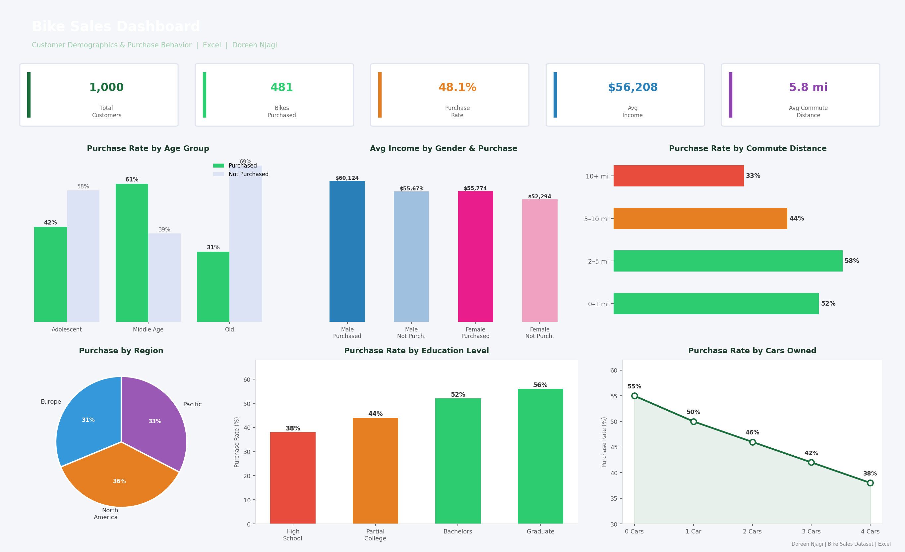

# 🚲 Bike Sales Excel Dashboard Project

This project analyzes bike sales data using **Excel** to uncover key insights into customer demographics and purchase behavior. It follows a structured analytics process — from data cleaning to interactive dashboard design.

---

## 📁 Dataset

**File:** `Excel Project Dataset.xlsx`

| Column | Description |
|--------|-------------|
| Age, Gender, Region | Customer demographics |
| Income | Customer annual income |
| Commute Distance | Distance to work |
| Cars Owned | Number of cars owned |
| Education | Highest education level |
| Bike Purchased | Whether the customer bought a bike (Yes/No) |

---

## 🧹 Steps Taken

### 1. Data Cleaning
- Removed duplicate records
- Standardized categorical entries (e.g. gender capitalization, marital status)
- Checked for missing or invalid values
- Created helper columns (e.g. age group categorization)

### 2. Data Transformation
- Created calculated columns using Excel formulas:
  - `=IF` for age groups (Adolescent, Middle Age, Old)
  - Income categories, commute bins, etc.
- Used Excel tables for dynamic referencing

### 3. Pivot Tables
Built Pivot Tables for:
- Sales by Region, Gender, and Income Group
- Bike purchase trends by Age, Education, and Commute Distance
- Customer segmentation

### 4. Dashboard Design
Interactive dashboard built with:
- Pivot Charts (bar, column, pie, line)
- Slicers for dynamic filtering (Gender, Region, Marital Status)
- Clean layout with titles, legends, and colour formatting

---

## 📊 Key Insights

- **Age:** Customers aged 31–50 (Middle Age) are most likely to purchase bikes
- **Income:** Higher income strongly correlates with higher purchase rates
- **Commute:** Short commuters (0–5 miles) show the highest purchase rates — bikes as a commuting tool
- **Region:** North America leads in purchase rate across all regions
- **Education:** Graduate-level customers have the highest purchase conversion
- **Cars Owned:** Customers with fewer cars are more likely to buy bikes

---

## 🛠️ Tools Used

| Tool | Purpose |
|------|---------|
| **Microsoft Excel** | Pivot Tables, Charts, Slicers, Conditional Formatting |
| **IF / NESTED IF formulas** | Age group and income categorization |

---

## 👤 About Me

Hi, I'm **Doreen Njagi** — a Data Analyst with a background in Mathematics and Computer Science, based in Nairobi, Kenya 🇰🇪.

I specialize in SQL, Python, Excel, Power BI, and Tableau — turning raw data into clear, actionable insights.

- 📫 [LinkedIn](https://www.linkedin.com/in/doreen-njagi-196350389/)
- 🌐 [Portfolio](https://doreennjagi.github.io/reen-data-portfolio)
- 🐙 [GitHub](https://github.com/doreennjagi)
